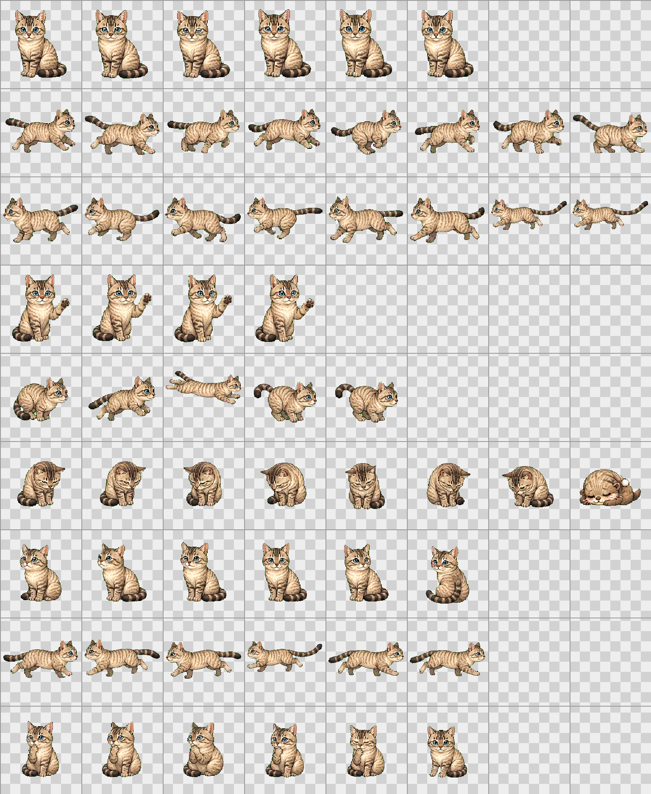

# Chouchou Codex Pet

Chouchou 是一只奶油色虎斑小猫 Codex 自定义宠物。



## 文件

- `pet.json`：Codex 自定义宠物清单。
- `spritesheet.webp`：正式透明背景图集。
- `spritesheet-preview.png`：带网格的预览图。
- `setup-chouchou-pet.ps1`：安装脚本。
- `validate_spritesheet.py`：图集校验脚本。

## 安装

```powershell
.\setup-chouchou-pet.ps1 -SpritePath .\spritesheet.webp
```

安装后在 Codex 中进入 `Settings > Appearance > Pets`，选择 `Chouchou`。

如果宠物没有显示，点击宠物设置页上方的 `Wake Pet`。

## 校验

```powershell
python .\validate_spritesheet.py .\spritesheet.webp
```

图集规格：

- 总尺寸：`1536 × 1872`
- 网格：`8 × 9`
- 单格：`192 × 208`
- 背景：透明
- 未使用格：完全透明
