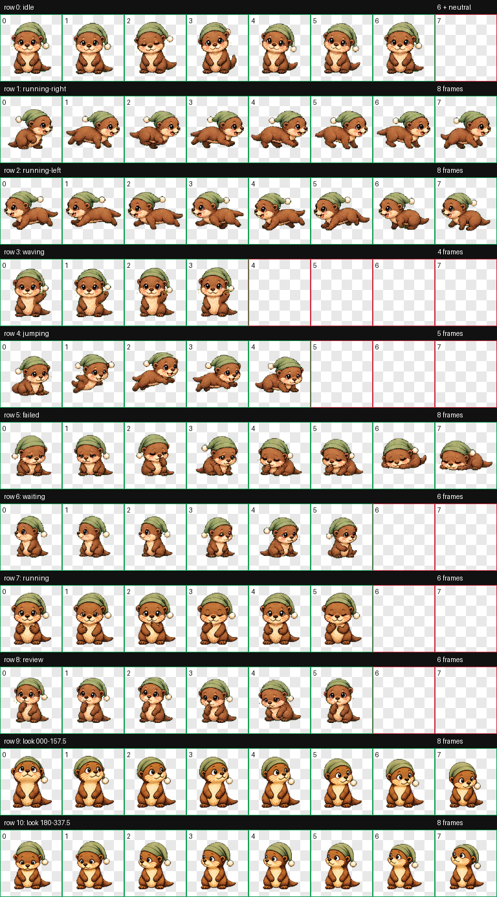

# Otto Codex Pet

Otto 是一只戴绿色睡帽的小水獭 Codex 自定义宠物。当前版本使用 Codex Pet v2 图集，包含 16 个注视方向。



## 文件

- `pet.json`：Codex 自定义宠物清单，声明 `spriteVersionNumber: 2`。
- `spritesheet.webp`：正式透明背景图集。
- `spritesheet-preview.png`：带棋盘格、网格和行标签的预览图，不参与安装。
- `setup-otto-pet.ps1`：Windows 安装脚本。
- `validate_spritesheet.py`：v2 图集与清单校验脚本。
- `art_prompt.txt`：角色与 v2 美术规格说明。

## 安装

```powershell
.\setup-otto-pet.ps1 -SpritePath .\spritesheet.webp
```

安装后在 Codex 中进入 `Settings > Appearance > Pets`，选择 `Otto`。如果宠物没有显示，点击宠物设置页上方的 `Wake Pet`。

## 校验

```powershell
python .\validate_spritesheet.py .\spritesheet.webp
```

图集规格：

- Sprite 版本：`2`
- 总尺寸：`1536 × 2288`
- 网格：`8 × 11`
- 单格：`192 × 208`
- 背景：透明
- 未使用格：完全透明
- 中性帧：第 0 行第 6 列
- 注视方向：第 9–10 行，共 16 个方向

注视方向从第 9 行第 0 列开始，以 `22.5°` 递增：`000°` 为向上，`090°` 为屏幕右侧，`180°` 为向下，`270°` 为屏幕左侧。

第 7 行的 `running` 是 Codex 执行任务时的原地工作/处理动画，不是横向移动动画。
