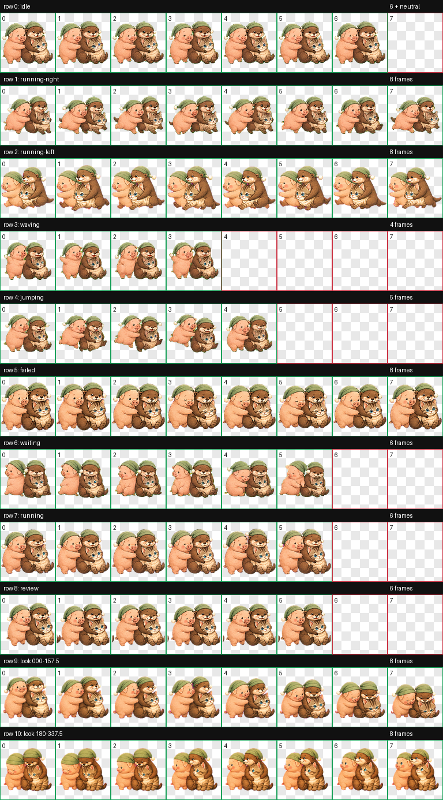

# Zhuchouta Codex Pet V2

Zhuchouta 是一组由小猪、小水獭和虎斑小猫组成的 Codex 自定义宠物。V2 保留并修复了九行标准动画，增加 neutral 帧和完整的 16 个顺时针环视方向。



## GitHub 目录结构

```text
zhuchouta-codex-pet/
├── README.md
├── pet.json
├── spritesheet.webp
├── spritesheet-preview.png
├── setup-zhuchouta-pet.ps1
└── validate_spritesheet.py
```

- `pet.json`：V2 宠物清单，包含 `spriteVersionNumber: 2`。
- `spritesheet.webp`：正式透明背景图集。
- `spritesheet-preview.png`：带行标签、网格和透明背景示意的 GitHub 预览图。
- `setup-zhuchouta-pet.ps1`：Windows 安装脚本。
- `validate_spritesheet.py`：V2 图集校验脚本。

## 安装

```powershell
.\setup-zhuchouta-pet.ps1 -SpritePath .\spritesheet.webp
```

安装后在 Codex 中进入 `Settings > Appearance > Pets`，选择 `Zhuchouta`；如果宠物没有显示，点击 `Wake Pet`。

## V2 图集规格

- 总尺寸：`1536 × 2288`
- 网格：`8 × 11`
- 单格：`192 × 208`
- 清单版本：`spriteVersionNumber: 2`
- 第 0–8 行：九个标准动画状态
- 第 0 行第 6 列：neutral 帧
- 第 9–10 行：16 个顺时针环视方向
- 背景与未使用格：完全透明

方向顺序：

```text
row 9:  000, 022.5, 045, 067.5, 090, 112.5, 135, 157.5
row 10: 180, 202.5, 225, 247.5, 270, 292.5, 315, 337.5
```

`000` 表示向上，`090` 表示屏幕右侧，`180` 表示向下，`270` 表示屏幕左侧。无方向输入时，Codex 回退到普通 idle 动画。

## 校验

```powershell
python .\validate_spritesheet.py .\spritesheet.webp
```

校验脚本会检查 V2 尺寸、11 行布局、使用格内容、未使用格透明状态，以及完全透明像素是否仍有 RGB 残留。
